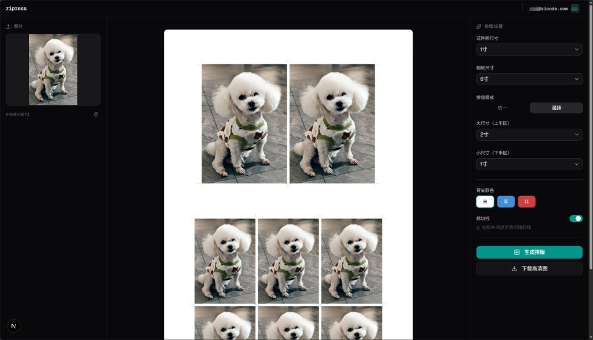

# zipress

<p align="center">
  <strong>EN</strong> · <a href="#english">English</a>
  &nbsp;|&nbsp;
  <strong>中文</strong> · <a href="#简体中文">简体中文</a>
</p>

<p align="center">
  
</p>

<p align="center">
  <em>Main UI: mixed layout (2-inch top + 1-inch bottom) on 6-inch paper, with cutting guides · 主界面：6 寸相纸混排预览（上半 2 寸 / 下半 1 寸），含裁切线</em>
</p>

---

## English

**zipress** is an open-source tool for arranging ID / passport photos on print sheets. Upload a source image, pick paper and layout mode, and export a **300 DPI** JPEG with optional cutting guides — for home or shop printing.

### Features

- **Photo sizes**: 1-inch, small 2-inch, 2-inch, large 2-inch (Chinese standard mm)
- **Paper sizes**: 5-inch, 6-inch, A4
- **Layout modes**: **uniform** (single size grid) or **mixed** (large + small regions on one sheet)
- **Cutting guides**: dashed lines between cells
- **Background colors**: white, blue, red (or custom via engine)
- **Account**: email + password (better-auth, Drizzle)

### Architecture

```
zipress/
├── web/       # Next.js frontend + auth (Tailwind, shadcn/ui)
├── engine/    # FastAPI + Pillow layout engine
└── docker-compose.yml
```

### Quick start

```bash
# Dev (Docker)
docker compose -f docker-compose.dev.yml up

# Production
docker compose up -d
```

Or run locally:

```bash
cd engine && uv sync && uv run uvicorn app.main:app --reload --host 127.0.0.1 --port 8000
cd web && pnpm install && pnpm dev
```

Configure `web/.env.local` (`ENGINE_URL`, `DATABASE_URL`, `BETTER_AUTH_SECRET`, etc.). Use the **same host** in the browser as `NEXT_PUBLIC_APP_URL` (e.g. `http://localhost:3000`) so auth cookies match.

### Tech stack

| Layer | Stack |
|-------|--------|
| Web | Next.js (App Router), TypeScript, TailwindCSS, shadcn/ui, better-auth, Drizzle |
| Engine | Python 3.12, FastAPI, Pillow, uvicorn |
| Ops | Docker Compose · SQLite (dev) / PostgreSQL (prod) |

### Standard sizes (300 DPI)

| Photo | mm | px |
|-------|-----|-----|
| 1-inch | 25 × 35 | 295 × 413 |
| Small 2-inch | 33 × 48 | 390 × 567 |
| 2-inch | 35 × 49 | 413 × 579 |
| Large 2-inch | 35 × 53 | 413 × 626 |

| Paper | mm | px |
|-------|------|------|
| 5-inch | 89 × 127 | 1050 × 1500 |
| 6-inch | 102 × 152 | 1205 × 1795 |
| A4 | 210 × 297 | 2480 × 3508 |

### License

[MIT](LICENSE)

---

## 简体中文

**zipress** 是一款开源证件照**排版**工具：上传源图，选择相纸与排版模式，导出 **300 DPI** 打印级整版图，可选裁切辅助线，适合家庭或文印店输出。

### 功能概览

- **证件照尺寸**：1 寸 / 小 2 寸 / 2 寸 / 大 2 寸（国标毫米定义）
- **相纸**：5 寸 / 6 寸 / A4
- **排版模式**：**统一**（单尺寸铺满）或 **混排**（同一张相纸上大、小尺寸分区）
- **裁切线**：照片之间的虚线辅助线
- **背景色**：白 / 蓝 / 红等（引擎侧可扩展）
- **账号**：邮箱 + 密码（better-auth + Drizzle）

### 仓库结构

见上文 Architecture；前端在 `web/`，排版引擎在 `engine/`。

### 快速开始

开发与生产命令见上文 **Quick start**。本地需在 `web/.env.local` 配置引擎地址与数据库等。**浏览器访问地址**需与 `NEXT_PUBLIC_APP_URL` 一致（例如统一使用 `http://localhost:3000`），否则 better-auth 会话域名不一致会导致无法注册/登录。

### 技术栈

与上文 **Tech stack** 表一致。

### 尺寸表（300 DPI）

与上文 **Standard sizes** 表一致。

### 许可证

[MIT](LICENSE)

---

## TODO / Roadmap · 路线图

| Priority | Task (EN) | 任务（中文） |
|----------|-----------|--------------|
| P1 | Background removal / solid-color backdrop (optional pipeline, e.g. rembg) | 背景去除 / 换底色（可选步骤，与排版解耦） |
| P1 | Face detection & center crop | 人脸检测与居中裁剪 |
| P2 | Multi-page PDF export | PDF 多页导出 |
| P2 | A4 multi-sheet layouts | A4 多页拼版 |
| P2 | One-click presets (e.g. “6-inch 8× 1-inch”) | 排版模板预设（一键参数） |
| P2 | UI i18n (EN / 中文) | 界面国际化 |
| P3 | Per-user last-used parameters | 登录用户保存最近一次参数 |
| P3 | Basic image adjustments (brightness / contrast / sharpness) | 简单图像调节（亮度/对比度/锐度） |
| — | Golden images & stronger engine tests | 引擎 golden 图与单测加强（持续） |

Contributions welcome — open an issue or PR.

欢迎通过 Issue / PR 参与贡献。
